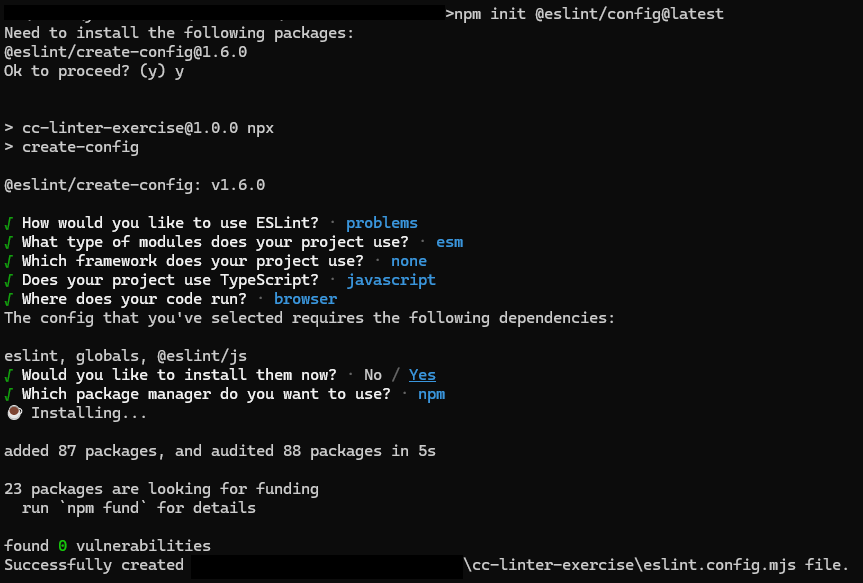

## Clean Code - Linters

_[PT-BR] only 'cause its a simple college project._

Este repositório foi criado para resolução de exercícios do _Tópico 7 - Linters_ da grade **Clean Code**. [Modelo do Exercício.](https://gitlab.com/professor-rvenson/cleancode-2025-1/-/blob/main/exercicios/exercicio-linters.md?ref_type=heads)

| **Linguagem Sorteada** | **Linter Escolhido** |
|------------------------|----------------------|
| JavaScript             | ESLint               |

### Tabela de Conteúdos

- [Clean Code - Linters](#clean-code-linters)
   * [Sobre o Linter](#sobre-o-linter)
   * [Instalação](#instalação)
      + [Pré-Requisitos](#pré-requisitos)
      + [Configuração Inicial](#configuração-inicial)
   * [Integração da Ferramenta](#integração-da-ferramenta)
      + [Regras](#regras)
      + [Utilização](#utilização)
   * [Automatização](#automatização)
      + [Git Hooks](#git-hooks)
      + [CI/CD](#cicd)
   * [Guias de Estilo](#guias-de-estilo)
   * [Exemplos](#exemplos)

### Sobre o Linter

ESLint é a biblioteca para JavaScript/ECMAScript mais utilizada no mercado, criada em 2013 pelo desenvolvedor **Nicholas C. Zakas** (Yahoo!, Human Who Codes). A ferramenta é utilizada para padronizar o código, garantir a qualidade e evitar erros comuns em projetos.

Alguns números da ferramenta: 

- 📥 **~50 milhões** de downloads semanais via npm
- 🌟 **25.7k** de _stars_ e **+10k** _issues_ fechadas no GitHub
- 💾 **+10k** commits 

### Instalação

Seguindo a documentação oficial, iremos seguir este tutorial com a instalação da última versão disponível: **v9.23.0**.

#### Pré-Requisitos

**Node.js** (nas versões ^18.18.0, ^20.9.0 ou >=21.1.0) instalado e com suporte a SSL.

_Obs.: caso você esteja usando uma distribuição oficial do Node.js, o SSL sempre estará integrado_.

Arquivo **package.json** criado, para que o setup instale os pacotes corretamente.

```bash
# npm
npm init @eslint/config@latest

# yarn
yarn create @eslint/config

# pnpm
pnpm create @eslint/config@latest

# bun
bun create @eslint/config@latest
```

#### Configuração Inicial

Após rodar o comando acima, serão feitas algumas perguntas para criar o arquivo de configuração com base nas opções selecionadas.

Para este projeto, criaremos um projeto JavaScript _vanilla_ com o seguinte setup: 



### Integração da Ferramenta
 
#### Regras

O arquivo criado, `esling.config.mjs`, deve estar com essa configuração:

```js
import { defineConfig } from "eslint/config";
import globals from "globals";
import js from "@eslint/js";


export default defineConfig([
  { files: ["**/*.{js,mjs,cjs}"] },
  { files: ["**/*.{js,mjs,cjs}"], languageOptions: { globals: globals.browser } },
  { files: ["**/*.{js,mjs,cjs}"], plugins: { js }, extends: ["js/recommended"] },
]);
```

Podemos então adicionar [Regras](https://eslint.org/docs/latest/rules/), que são o conceito principal da biblioteca: validar se o código atende a uma expectativa e o que fazer caso ele não atenda a mesma. Também podemos estender as configurações com opções adicionais específicas para a regra criada.

**Gravidade das Regras**

- **“off”** ou **0** - desativa a regra
- **“warn”** ou **1** - ativa a regra como um aviso (não afeta o código de saída)
- **“error”** ou **2** - ativa a regra como um erro (o código de saída será 1)

Normalmente, as regras são utilizadas sempre como _error_, para forçar a conformidade do código. Utilize _warn_ caso queira que o ESLint reporte a violação da regra, mas não interrompa nenhum processo. Geralmente utilizamos este método ao inserir uma nova regra que eventualmente será alterada para _error_.

Exemplo: 

```js
import js from "@eslint/js";
import { defineConfig } from "eslint/config";
import globals from "globals";


export default defineConfig([
  { files: ["**/*.{js,mjs,cjs}"] },
  { files: ["**/*.{js,mjs,cjs}"], languageOptions: { globals: globals.browser } },
  { 
    files: ["**/*.{js,mjs,cjs}"],
    plugins: { js }, 
    extends: ["js/recommended"],
    rules: {
      "no-unused-vars": "error",
      "no-undef": "warn",
    },
  },
]);
```

#### Utilização

Podemos rodar o ESLint da seguinte forma:

> Note que utilizamos o `.` para indicar que devemos verificar todos os arquivos, veja mais opções na [documentação oficial](https://eslint.org/docs/latest/use/command-line-interface)

```bash
# npm (via npx)
npx eslint .

# yarn
yarn dlx eslint .

# pnpm
pnpm dlx eslint .

# bun
bunx eslint .
```

Para facilitar integrações e automatizações, podemos adicionar um script no arquivo `package.json`:

```json
// Exemplo somente com o npm, mas pode ser adicionado 
// qualquer outro gerenciador de pacotes citado acima
{
  "scripts": {
    "lint": "npx eslint ."
  }
}
```

E rodar o comando:

```bash
# npm
npm run lint

# yarn
yarn lint

# pnpm
pnpm lint

# bun
bun lint
```
### Automatização

Existem várias maneiras de automatizar a execução do ESLint, mostraremos duas delas:

#### Git Hooks

Git Hooks são scripts que são executados automaticamente em determinados eventos do Git, como _commit_, _push_, _pull_ e _merge_. Podemos adicionar o ESLint em um _hook_ para que ele valide o código a cada _commit_.

Para isso, iremos utilizar uma biblioteca chamada **Husky**. Abra a [documentação oficial](https://typicode.github.io/husky/get-started.html) para ter um guia de instalação detalhado sobre o assunto. Como não é o foco, iremos utilizar o setup básico que o Husky nos fornece.

```bash
# npm
npx husky init

# yarn
# Devido algumas diferenças do yarn como gerenciador de pacotes, é necessário instalar o husky manualmente 

# pnpm
pnpm exec husky init

# bun
bunx husky init
```

Após efetuar a instalação, será criado uma pasta chamada `.husky` na raiz do projeto, com um arquivo chamado `pre-commit`. Adicione neste arquivo o comando `npm run lint` que criamos anteriormente.

Agora, para cada _commit_ que você fizer, o ESLint irá rodar e validar o código antes de permitir que o _commit_ seja efetuado.

> Há mais configurações que podem ser feitas para checar somente os arquivos que serão adicionados no _commit_, mas para facilitar o entendimento, não iremos abordar este assunto.

#### CI/CD

Podemos adicionar o ESLint em um _workflow_ do GitHub Actions, para que ele valide o código a cada _push_ ou _pull request_.

```yaml
name: Pipeline

on:
  push:
    branches:
      - main
  pull_request:
    branches:
      - main

jobs:
  build:
    runs-on: ubuntu-latest

    steps:
      - name: Checkout código
        uses: actions/checkout@v4

      - name: Configurar Node.js
        uses: actions/setup-node@v4
        with:
          node-version: '20'

      - name: Instalar dependências
        run: npm install

      - name: Verificar ESLint # Esta etapa garantirá que o código esteja de acordo com as regras
        run: npm run lint

      - name: Rodar aplicação
        run: npm run start
```

### Guias de Estilo

O ESLint permite que você crie seu próprio guia de estilo, mas também permite que você utilize guias de estilo já prontos. Na instalação manual, você consegue diretamente pelo CLI escolher os três guias de estilo mais utilizados:

- [Airbnb](https://www.npmjs.com/package/eslint-config-airbnb)
- [Google](https://www.npmjs.com/package/eslint-config-google)
- [Standard](https://www.npmjs.com/package/eslint-config-standard)

Note que no nosso exemplo, utilizamos o guia de estilo `js/recommended`, que é um guia de estilo recomendado pela própria equipe do ESLint.

```js
import js from "@eslint/js";
import { defineConfig } from "eslint/config";
// ...

export default defineConfig([
  // ...
  { 
    files: ["**/*.{js,mjs,cjs}"],
    plugins: { js }, 
    extends: ["js/recommended"] // aqui podemos usar qualquer configuração
  },
]);

```

> Note que também podemos adicionar várias extensões, dependendo da complexidade do projeto e o que você deseja validar.


### Exemplos

Existem [diversas regras](https://eslint.org/docs/latest/rules/) que podemos configurar no ESLint, mas para facilitar o entendimento, iremos mostrar alguns exemplos de regras que são comuns em projetos JavaScript.

**no-unused-vars** - Evita que variáveis sejam declaradas e não utilizadas.

```js
// ❌ Variável declarada, mas não utilizada
let x;

// ❌ Variável que é modificada, mas não utilizada
let y = 10;
y = 5;

// ❌ Variável que chama a si mesma para efetuar uma modificação
let z = 0;
z = z + 1;

// ❌ Argumentos não utilizados
(function(foo) {
    return 5;
})();

// ❌ Funções recursivas não utilizadas
function fact(n) {
    if (n < 2) return 1;
    return n * fact(n - 1);
}

// ❌ Quando uma função desestrutura um array, itens não utilizados também acionarão a regra
function getY([x, y]) {
    return y;
}
getY(["a", "b"]);

// ✅ Variável utilizada
let a = 10;
console.log(a);
```
**no-const-assign** - Evita que constantes sejam modificadas.

```js
const x = 10;
x = 5; // ❌

const y = 10;
y += 5; // ❌

const z = 10;
z++; // ❌

for (const a of [1, 2, 3]) { // ✅ A variável `a` é re-definida (não modificada) para cada iteração do loop
    console.log(a);
}
```

**no-duplicate-imports** - Evita que módulos sejam importados mais de uma vez.

```js 
// ❌ Importação duplicada
import { foo } from "./foo";
import { bar } from "./foo";

// ✅ Correto

import { foo, bar } from "./foo";
```

